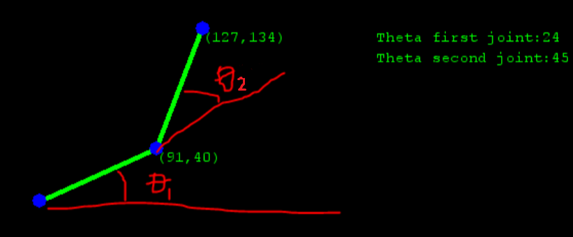

This work is licensed under the Creative Commons Attribution-NonCommercial-ShareAlike 4.0 International License. 
To view a copy of this license, visit http://creativecommons.org/licenses/by-nc-sa/4.0/. 
You may also visit https://creativecommons.org/licenses/by-nc-sa/4.0/legalcode 

# 2 Degree-of-Freedom (DOF) Robotic Arm Testbed Overview
This testbed models a mechanical arm and simulates its motion with respect to changing angles. This testbed utilizes a control system with a PID scheme.

## List of Functions
* Move arm piece 1 (ϴ1)
* Move arm piece 2 (ϴ2)
* Adjust length of arm piece 1
* Adjust length of arm piece 2
* Regulates stable arm control using a continuous control scheme

## List of Components
The robot arm consists of two attached stages conceptually similar to a human anatomical arm, with robot arm 1 representing the humerus and robot arm 2 representing the radius/ulna. 

In the graphic below, robot arm 1 begins at the base (lower-left) and ends at (91,40). Robot arm 2 begins at (91,40) and ends at (127,134). 

  

 

## List of Addressable Components
The ladder logic creates ten addressable components. 

| Name | Location   | Description |
| :-- | :-: | :-- |
| Tau1 | %IW0 | Input torque for robot arm 1 |
| Tau2 | %IW1 | Input torque for robot arm 2 |
| Theta1 | %IW2 | Input angle of robot arm 1 sent to HMI via UDP |
| Theta2 | %IW3 | Input angle of robot arm 2 sent to HMI via UDP |
| Theta1_out | %QW0 | Output setpoint for the angle of robot arm 1 on Simulink Model |
| Theta2_out | %QW1 | Output setpoint for the angle of robot arm 2 on Simulink Model |
| Theta1_sp | %QW2 | Output setpoint value of angle 1 on HMI (read via UDP) |
| Theta2_sp | %QW3 | Output setpoint value of angle 2 on HMI (read via UDP) |
| Length1 | %QW4 | Output length of robot arm 1 |
| Length2 | %QW5 | Output length of robot arm 2 |

## Robotic Arm GUI
This program reads the state of a 2 DOF robotic arm from the memory of a PLC using the TCP MODBUS protocol and renders a visualization for the robotic arm. This GUI was written by Dr. Rishabh Das in [his repo](https://github.com/Cybereigenvector/Robotic-Arm-GUI) and was used in place of a human-machine interface (HMI) during the early stages of development of the testbed. It is bundled into this repo so that contributors may have another way to visualize the behavior of the Robotic Arm. 
*Note:* This Python program can be run independent of the datalogger and the attack script, so as to provide a visualization of the system.  

## Simulink Model
The Real Time Slower module is needed to run the Simulink model correctly.
